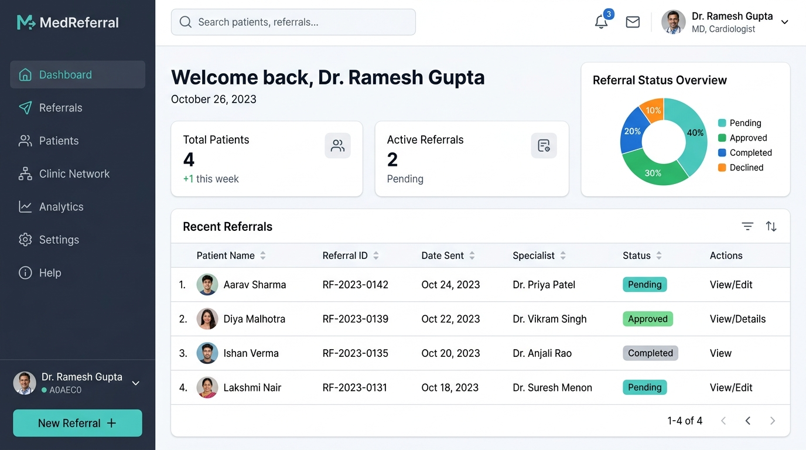
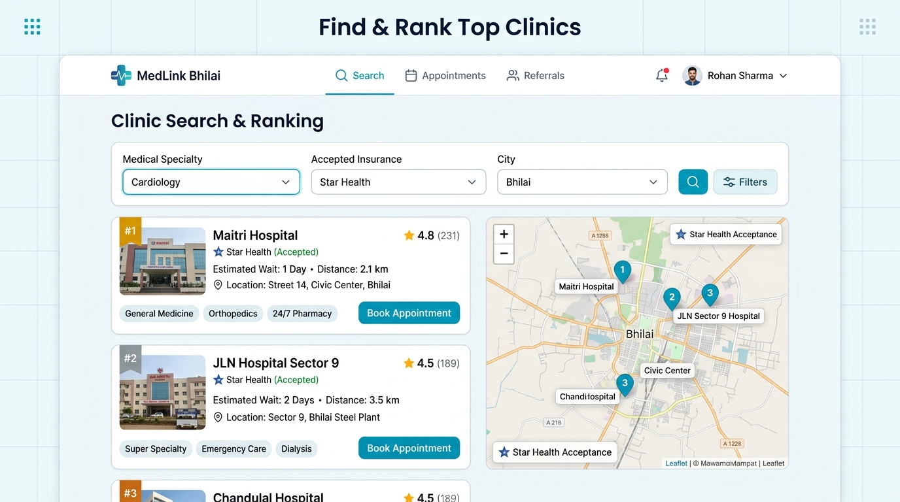
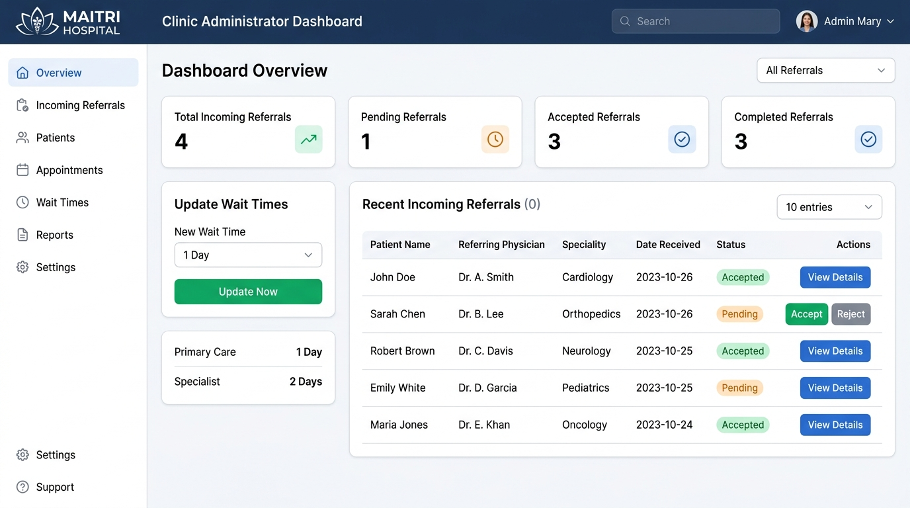
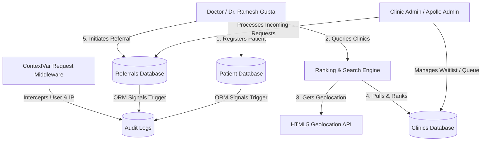

# Decentralized Medical Clinic Referral Network (India Context)

[](https://www.djangoproject.com/)
[](https://www.python.org/)
[](https://www.sqlite.org/)
[](LICENSE)

A production-quality Django web application enabling doctors to refer patients to nearby specialized clinics in India. The application features automatic clinic ranking based on queue wait time, geographical distance (Haversine formula via HTML5 Geolocation), and insurance compatibility. It is fully equipped with Role-Based Access Control (RBAC) and automated context-aware security auditing.

---

## 🌟 Key Features

*   **Role-Based Access Control (RBAC):** Strict partition of actions between `Doctors` and `Clinic Administrators` using custom Django mixins.
*   **Intelligent Clinic Ranking Algorithm:** Automatically matches and sorts clinics using three prioritized business rules:
    1.  **Priority 1:** Estimated Queue Wait Time (Ascending)
    2.  **Priority 2:** GPS Distance (Ascending, using the Haversine formula)
    3.  **Priority 3:** Insurance Plan Compatibility (Descending)
*   **Autonomic Auditing System:** Context-aware request middleware tracking model saves, edits, deletions, and views in an `AuditLog` database (automatically capturing active usernames and client IP addresses).
*   **Interactive Maps:** Embedded **Leaflet JS** map plotting GPS coordinates directly from the database onto OpenStreetMap.
*   **Dynamic Visual Analytics:** Real-time metrics charts rendering statuses and clinic wait days using **Chart.js**.
*   **Fully Pre-Seeded:** Seeder script populated with realistic Indian cities (Bhilai, New Delhi, Mumbai, Bangalore), hospitals (Apollo, Medanta, Maitri), and insurance networks (Star Health, Ayushman Bharat).

---

## 🖥️ Screen Previews & Screenshots

Here are high-fidelity UI mockups illustrating the main pages and workflows of the application:

### 1. Doctor Dashboard
Presents key practice numbers (Total Patients, Active Referrals), dynamic statistics charts, and recent records.


### 2. Clinic Search & Geographical Ranking
Features search filters, ranked clinic cards with wait days and accepted insurances, route distance, and a Leaflet GPS locator map.


### 3. Clinic Administrator Dashboard
Enables administrators to process incoming patient referrals (Accept/Reject/Complete) and configure queue wait days.


---

## 🏗️ System Architecture

The following Mermaid diagram outlines the data flow between doctors, patients, clinics, referrals, and the background auditing layer:



---

## 📁 Project Structure

```text
medical_referral/
│
├── accounts/               # User model, authentication flows, and RBAC mixins
│   ├── management/
│   │   └── commands/
│   │       └── seed_data.py # Indian-centric seeder command
│   ├── forms.py
│   ├── models.py
│   └── views.py
│
├── patients/               # Patient registry and directory views
│   ├── forms.py
│   ├── models.py
│   └── views.py
│
├── clinics/                # Hospital listings, specialties, and ranking logic
│   ├── forms.py
│   ├── models.py
│   ├── ranking.py          # Haversine distance & multi-sort ranking engine
│   └── views.py
│
├── referrals/              # Referral lifecycle workflow and state engines
│   ├── forms.py
│   ├── models.py
│   └── views.py
│
├── audit/                  # ContextVar request tracker and signal hooks
│   ├── middleware.py       # Intercepts user context & IP address
│   ├── signals.py          # Log triggers (view, create, edit, delete)
│   └── models.py
│
├── templates/              # Beautiful Bootstrap 5 responsive HTML layouts
└── static/                 # Custom CSS and JavaScript assets
```

---

## 🔑 Seeded Demo Credentials

You can log into the system using the following accounts. The password is the same for all roles:

| Username | Password | User Role | Initial Setup / Context |
| :--- | :--- | :--- | :--- |
| **`admin`** | `admin123` | System Superuser | Full access to Django admin panel. |
| **`dr_gupta`** | `doctor123` | Doctor | Dr. Ramesh Gupta. Manages patients (Aarav, Priya). |
| **`dr_sharma`** | `doctor123` | Doctor | Dr. Sunita Sharma. Manages patients (Amit, Ananya). |
| **`admin_apollo`** | `admin123` | Clinic Administrator | Manages *Indraprastha Apollo Hospital* (New Delhi). |
| **`admin_medanta`** | `admin123` | Clinic Administrator | Manages *Medanta - The Medicity* (Gurugram). |
| **`admin_maitri`** | `admin123` | Clinic Administrator | Manages *Maitri Hospital & Research Centre* (Bhilai). |
| **`admin_sector9`** | `admin123` | Clinic Administrator | Manages *JLN Sector 9 General Hospital* (Bhilai). |

---

## 🚀 Installation & Setup Guide

To run this application on your local machine, follow these steps:

### 1. Prerequisites
Make sure you have **Python 3.12+** installed on your system.

### 2. Clone and Setup Environment
Navigate to the directory and activate the virtual environment:
```powershell
# Create virtual environment (if not already done)
python -m venv .venv

# Activate on Windows Powershell
.venv\Scripts\Activate.ps1
# OR on Git Bash / Linux
source .venv/bin/activate
```

### 3. Install Dependencies
```bash
pip install django
```

### 4. Apply Database Migrations
Create and configure the SQLite database schema:
```bash
python manage.py makemigrations accounts patients clinics referrals audit
python manage.py migrate
```

### 5. Seed Indian Medical Database
Populate the catalogs, users, patients, clinics, and historical referral logs:
```bash
python manage.py seed_data
```

### 6. Run the Server
Launch the development server:
```bash
python manage.py runserver
```
Visit the application in your browser at **`http://127.0.0.1:8000/`**.

---

## 🛠️ Key Technical Details (Interview Discussion Points)

### 1. Request Context Tracking in background Signals
In standard Django projects, signals don't have access to the user request. In this codebase, `audit/middleware.py` intercepts request scopes using Python's thread-safe `contextvars`. When a model `post_save` or `post_delete` signal fires, the handler calls `get_current_request()` to log the actor's username and IP address.

### 2. Multi-Criteria Sorting Key
The sorting code uses Python's tuple comparison key:
```python
clinics_list.sort(key=lambda c: (
    c.estimated_wait_days,        # Priority 1: Lower wait days is better
    c.distance,                   # Priority 2: Closer distance is better
    -c.insurance_compatibility    # Priority 3: More compatible is better (descending)
))
```

### 3. Detail Read Auditing
Standard Django save/delete signals cannot audit model "views". To solve this, a custom signal `object_viewed` is triggered inside the view dispatch cycles of `PatientDetailView` and `ReferralDetailView` to log read transactions automatically.

---


